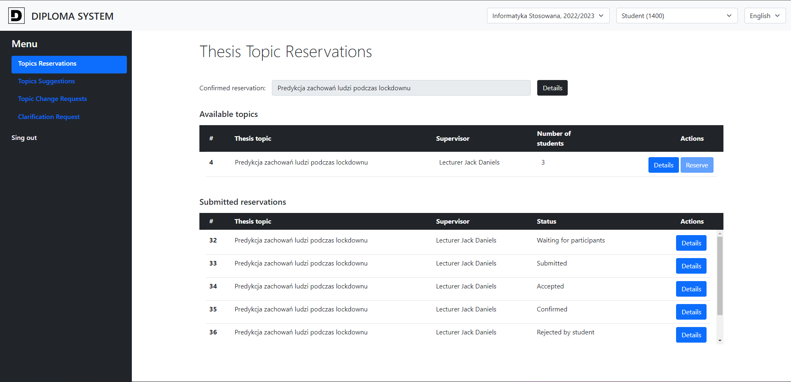
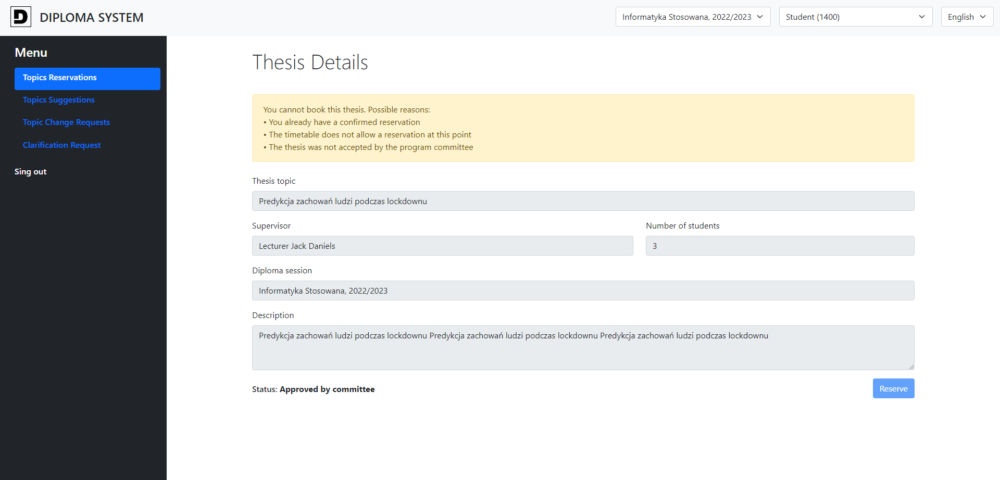
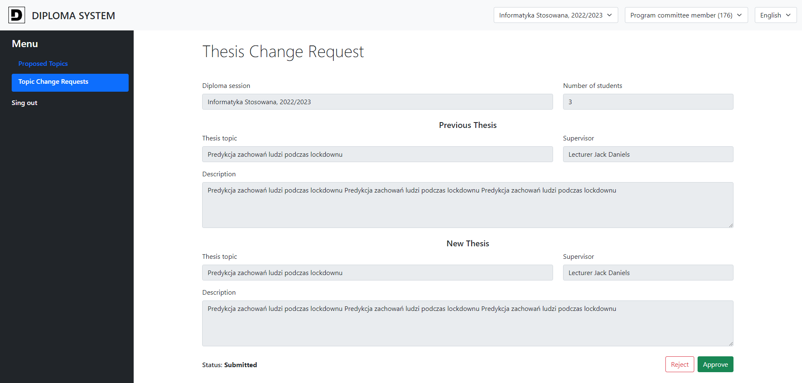
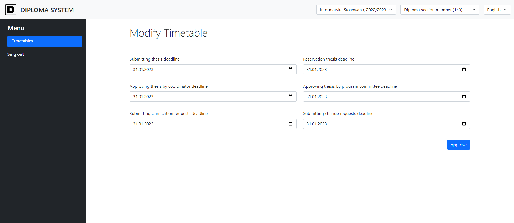
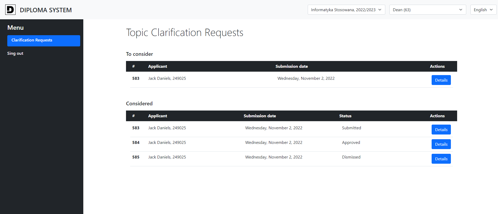
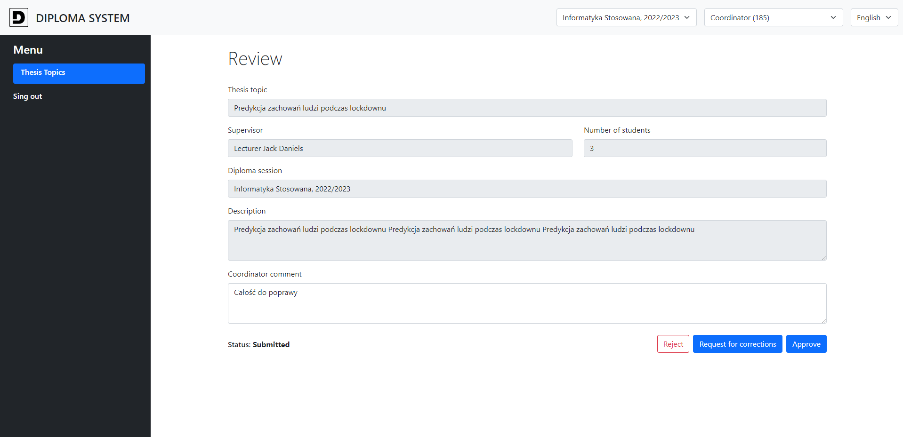
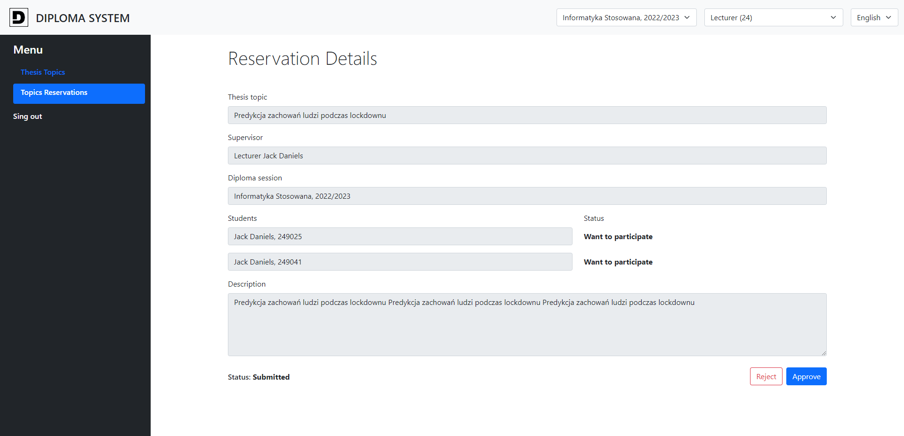
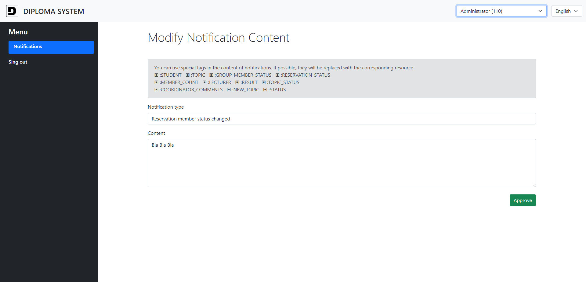

<!-- PROJECT LOGO -->
 

  

[![License][license-shield]][license-url]
![Top language][top-language-shield]
![Last commit][last-commit-shield]
![Contributors][contributors-shield]

<h3 align="center">Diploma System</h3>

  Student diploma thesis management system.  
   
  Create thesis, make reservations, submit requests, process and more.
   
  <a href="https://github.com/InBinaryWorld/DiplomaSystem"><strong>Explore the docs »</strong></a>
   
   
  <a href="https://github.com/InBinaryWorld/DiplomaSystem/issues">Report Bug</a>
  ·
  <a href="https://github.com/InBinaryWorld/DiplomaSystem/issues">Request Feature</a>

<!-- TABLE OF CONTENTS -->

## Table of Contents

* [About the Project](#about-the-project)
    * [Perspectives](#perspectives)
    * [How it started?](#how-it-started)
    * [Built With](#built-with)
* [License](#license)
* [Contact](#contact)

<!-- ABOUT THE PROJECT -->
## About The Project

Electronic management of diploma theses from the perspective of seven roles 
corresponding to the university community.

Implemented functions:
* Submitting proposals for theses.
* Performing reservations.
* Support for group Thesis and group reservations.
* Automatic document flow.
* Support for modify and change Thesis requests.
* Support for users with multiple roles (ex. lecturer who is also the dean).
* Different diploma sessions for different years.
* Access to actions controlled with editable schedule.
* Strong actions access control.
* Reviewing topic propositions and requests.
* Notifications services.

Non-functional requirements:
* English and Polish support
* Single Page Application 
* Strong caching abilities.
* Automatic session refreshing.

## Perspectives:

- Student

  
  

- Program committee member

  

- Diploma section member

  

- Dean

  

- Coordinator

  

- Lecturer

  

- Administrator

  

### How it started?

The project was created out during the IT Systems Design course. Its
implementation was preceded by a multi-stage architecture design using
various diagrams in the Visual Paradigm tool. The system was designed 
for the entire semester, but there were only a few weeks to implement it.

### Built With

Frontend part was created with:

* [Angular 13](https://angular.io/)
* [NgRx](https://ngrx.io/)
* [RxJS](https://reactivex.io/)
* [Bootstrap](https://getbootstrap.com/)
* [Cerialize](https://github.com/weichx/cerialize)
* [Lodash](https://lodash.com/)
* [Ngx Transtale](https://github.com/ngx-translate/core)

Resource server was created with:
* [Kotlin](https://kotlinlang.org/)
* [Spring Boot](https://spring.io/projects/spring-boot)
* [Jackson](https://www.baeldung.com/kotlin/jackson-kotlin)

Data were stored in [PostgreSQL](https://www.postgresql.org/)

<!-- LICENSE -->
## License

Distributed under the [GNUv3 License][license-url]. See `LICENSE`  for more information.

<!-- CONTACT -->
## Contact

[![Github][github-user1-shield]][github-user1-url]
[![Github][github-user2-shield]][github-user2-url]
[![Github][github-user3-shield]][github-user3-url]

<!-- MARKDOWN LINKS & IMAGES -->
[license-shield]: https://img.shields.io/github/license/InBinaryWorld/DiplomaSystem
[license-url]: https://github.com/InBinaryWorld/DiplomaSystem/blob/master/LICENSE
[top-language-shield]: https://img.shields.io/github/languages/top/InBinaryWorld/DiplomaSystem
[contributors-shield]: https://img.shields.io/github/contributors/InBinaryWorld/DiplomaSystem
[contributors-url]: https://github.com/InBinaryWorld/DiplomaSystem/graphs/contributors
[last-commit-shield]:https://img.shields.io/github/last-commit/InBinaryWorld/DiplomaSystem
[project-url]: https://github.com/InBinaryWorld/DiplomaSystem

[project-issue-url]: https://github.com/InBinaryWorld/DiplomaSystem/issues

[github-user1-shield]: https://img.shields.io/badge/-GitHub-black.svg?style=flat-square&logo=github&color=171515&label=InBinaryWorld
[github-user1-url]: https://github.com/InBinaryWorld

[github-user2-shield]: https://img.shields.io/badge/-GitHub-black.svg?style=flat-square&logo=github&color=171515&label=werekkk
[github-user2-url]: https://github.com/werekkk

[github-user3-shield]: https://img.shields.io/badge/-GitHub-black.svg?style=flat-square&logo=github&color=171515&label=ltomana
[github-user3-url]: https://github.com/ltomana
